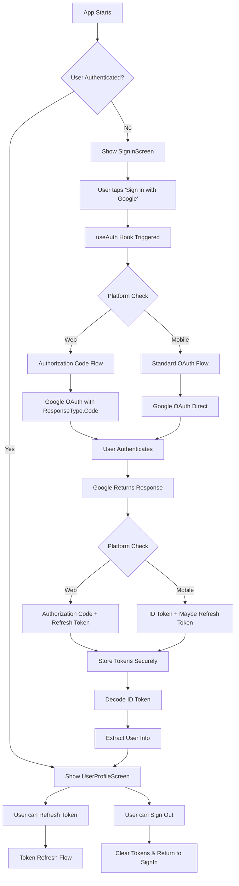
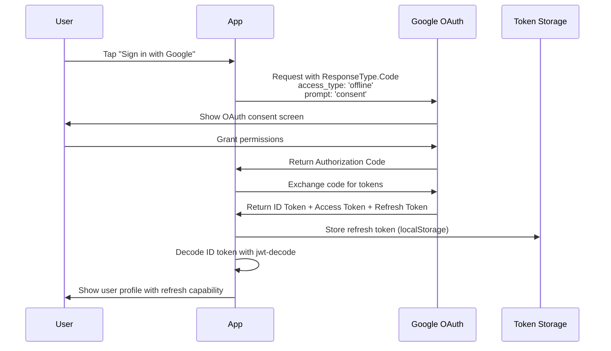
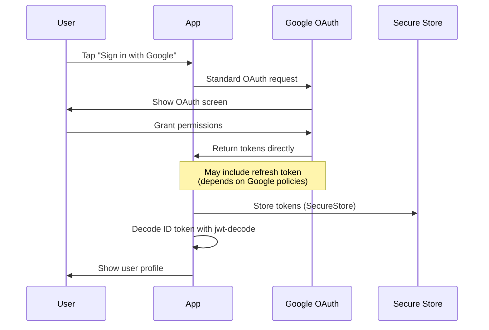
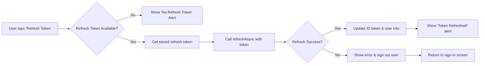
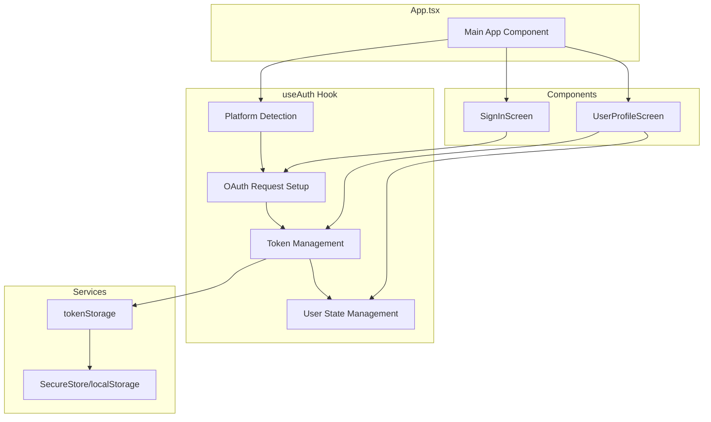
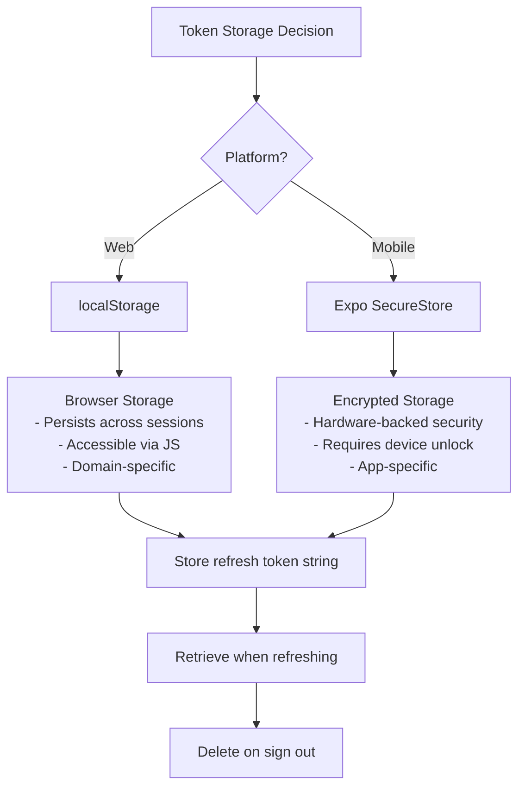
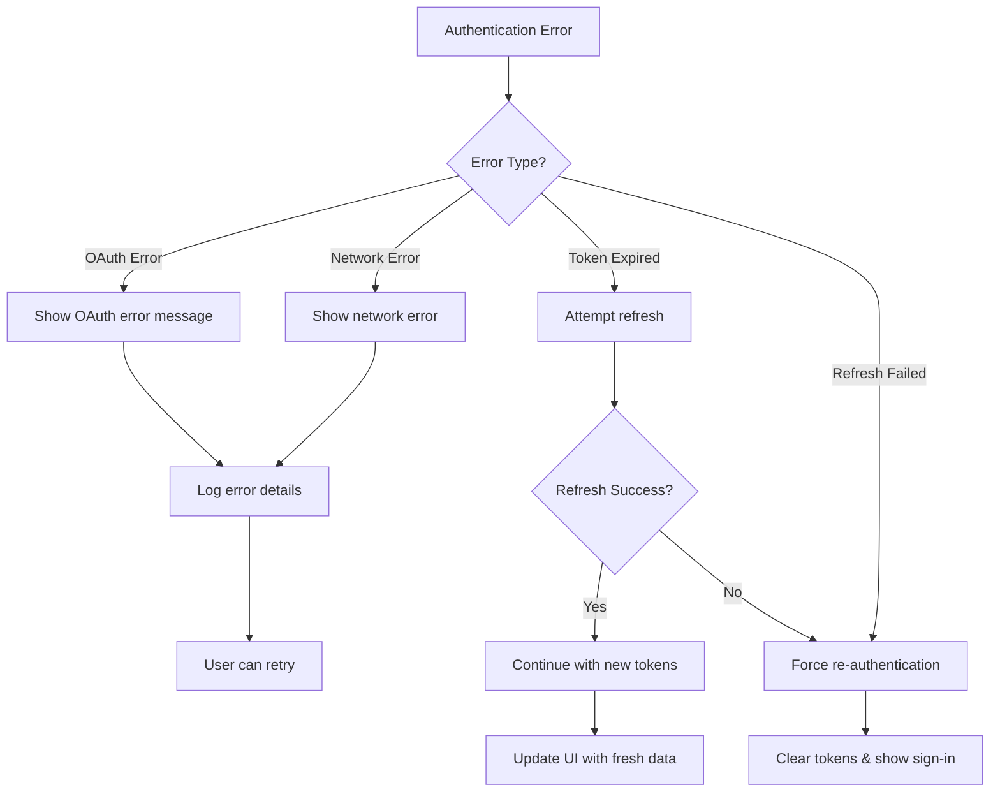
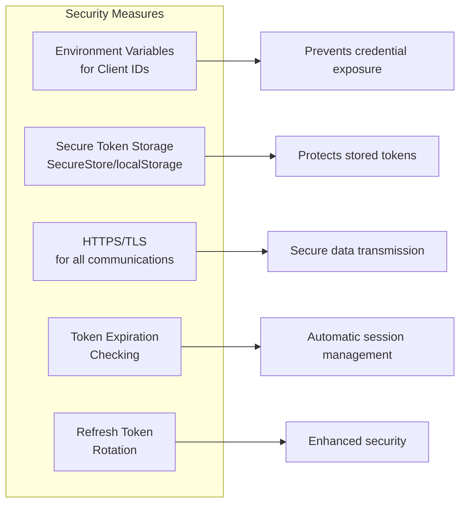

# Authentication Flow Diagram

This document provides visual diagrams explaining how Google OAuth authentication works in this React Native Expo app.

## Overall Authentication Flow



## Platform-Specific Authentication Details

### Web Platform (Authorization Code Flow)



### Mobile Platform (iOS/Android)



## Token Refresh Flow



## Component Architecture Flow



## Token Storage Strategy



## Error Handling Flow



## Security Considerations



## Key Features Summary

- **🔄 Platform-Specific Flows**: Web uses Authorization Code flow, Mobile uses standard OAuth
- **💾 Secure Storage**: SecureStore on mobile, localStorage on web
- **🔄 Token Refresh**: Manual refresh button with automatic token updates
- **🔒 Security**: Environment variables, secure storage, HTTPS communications
- **📱 Cross-Platform**: Consistent experience across iOS, Android, and Web
- **🎯 User-Friendly**: Clear error messages and intuitive UI flow

## Environment Variables Required

```
EXPO_PUBLIC_WEB_CLIENT_ID=your_web_client_id
EXPO_PUBLIC_IOS_CLIENT_ID=your_ios_client_id  
EXPO_PUBLIC_ANDROID_CLIENT_ID=your_android_client_id
EXPO_PUBLIC_CLIENT_SECRET=your_web_client_secret  # Required for web refresh tokens
```

---

*This diagram helps visualize the complete authentication flow and can be referenced when debugging or extending the authentication functionality.* 